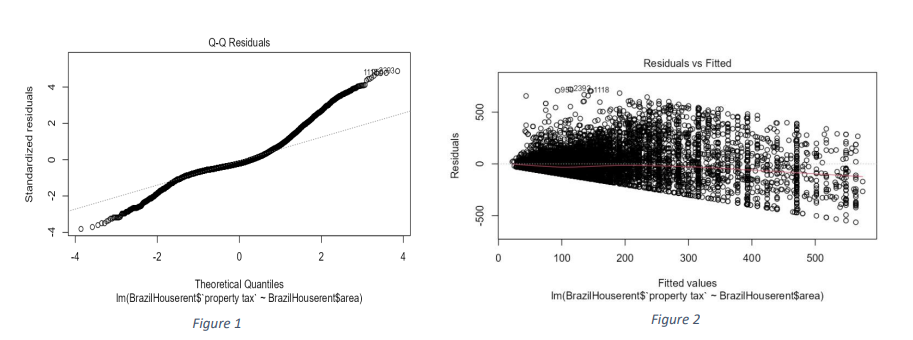
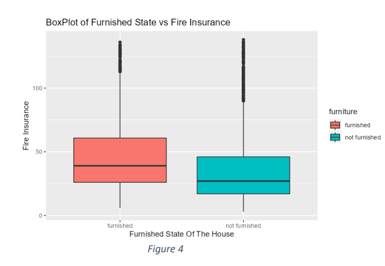

# [Analyzing Home Rental Prices In Brazil 🏠](https://DanukaDilshann.github.io/Data-Analysis-1/)
The dataset we are using contain house rent prices from different area of Brazil. The dataset includes Property area, how many bathrooms and bedrooms are there, how taxes are included in different areas, whether pets are allowed or not and the House is furnished or not.
Then our main goal is to understand those facts and identify which variables are related to house rent price go up or down in Brazil.

The Primary objectives are:

        Analyse the rent amount distribution
        Analyse the taxes and other expenses related to the rent amount.
        How to change the taxes in deferent different cities in Brazil
        How keeping animals affect the rent amount
        
## Abstract

The House Rental Price Dataset shows the House rental prices of different regions in Brazil. It is 
Include the multiple attributes such as City, Area (Square Feet), No. of Rooms, No. of Bathrooms, 
packing spaces, Floor, whether pets are allowed or not, whether furnished or not, Homeowners 
association tax (R$), Rent amount (R$), Municipal property tax (R$) and Fire insurance value 
(R$). Therefore, this dataset facilitates the analysis the house rental price in Brazil.

By understanding these factors that influence the Rent price of House, it is easy for house holder 
to determined the price and this helps the customer who are already looking to rent a House in Brazil 
to find house according to his price and according to his needs.

So here’s are my Research Question Regarding this Data set.

        1. Do the property taxes relate to the area?
        2. Does the fire insurance relate to when the house is furnished or not?
        3. Does the location relate to the Property taxes?
        4. Does the fire insurance price relate to the location?
        5. Does the rent amount relate to the when the house is furnished or not?
        6. Does the rent amount relate to the keeping animal?
        7. Does the rent amount relate to the city?

## Data Analysis
<b>1. Do the property taxes relate to the area?</b>

  

 

Based on the above graphs, we can observe violations of the Normality and Linearity assumptions. In Figure 1, the data points deviate significantly from the 45° line, indicating a violation of Normality. Additionally, in Figure 2, the data points do not exhibit random scattering around 0, suggesting a violation of the Linearity assumption. Despite attempting transformations, these assumptions remain violated. Therefore, we need to apply non-parametric methods.

  

The above plot represents the scatter plot of Area versus Property Taxes. Observing the scatterplot, we notice a positive relationship between the two variables. After computing the Spearman correlation (rs), we find its value to be 0.5861. As this value exceeds the critical threshold, we reject the null hypothesis (H0). Thus, we can conclude that there is a positive correlation between the two variables.

 

 

<b>2. Does the fire insurance relate to when the house is furnished or not?</b>

 

 

The boxplot represents the relationship between Fire Insurance and the Furnished State of the House. From the boxplot, it's evident that there is skewness present, indicating a violation of the Normality assumption. Consequently, parametric methods cannot be applied for analysis. Therefore, applying the Wilcox rank sum-test, we obtain a test statistic of 9135178 . As the test statistic exceeds the critical value of 3.841459, we reject the null hypothesis (Ho). This suggests significant differences exist between the median of the groups at a 5% significance level, indicating that furnished and not furnished houses have different medians.

Furthermore, upon examining the Five Number Summary within each boxplot, it's notable that the furnished category exhibits the highest median. This leads us to conclude that higher amounts of insurance are available for furnished houses.

## General Discussion and conclusions

    • As the Spearman correlation value, we could conclude that there is a positive correlation
    between Area and property taxes. That means property taxes are related to the Property 
    area.
    
    • If the House is furnished the fire Insurance value is high. That’s mean, Fire insurance is
    related to the Furnished or not.
    
    • The property taxes vary from city to city In Brazil. Some cities charge a higher rate, and 
    some cities charge a lower rate.
    
    • The Fire Insurance varies from city to city. Some Cities have faced forest fires several
    times in the year. Therefore, those city householders have to pay higher taxes than the 
    others. In our case, São Paulo citizens have to pay higher taxes than the other city 
    citizens.
    
    • If customers who are rent a new house depends on whether pets are allowed or not. If the 
    House owner accepts the keeping animals, the rent amount is increased. therefore, the 
    rent amount is related to the Keeping animal or not        

## [R-markdown file](https://github.com/DanukaDilshann/House-rental-price-in-Brazil/blob/main/Rmarkdown.pdf)
