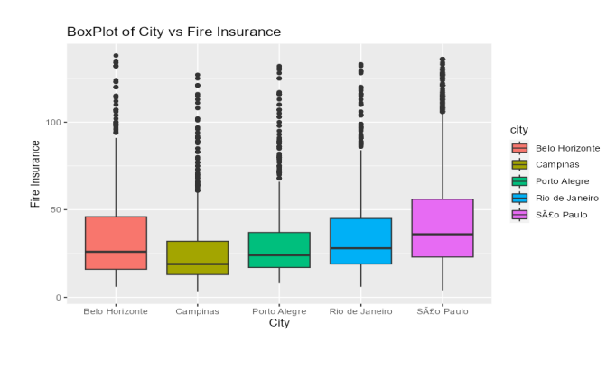
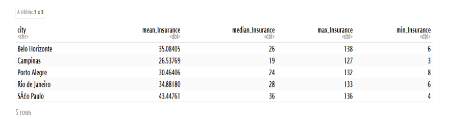
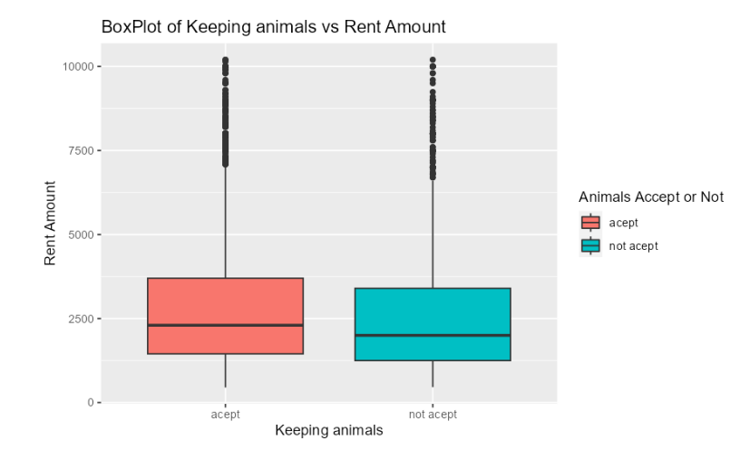
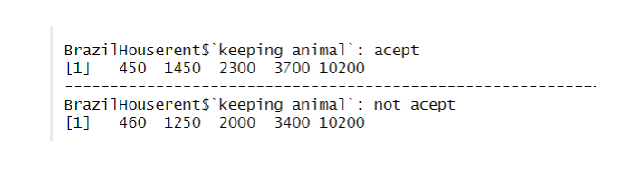

# Exploratory Data Analysis Home Rental Prices In Brazil 🏠

## Project Overview

Objective: To analyze the factors influencing house rental prices in different regions of Brazil, helping homeowners determine rental prices and aiding customers in finding houses that meet their needs and budget.

- Research Questions:
  - Do property taxes relate to the area?
  - Does fire insurance relate to whether the house is furnished or not?
  - Does location affect property taxes?
  - Does the fire insurance price relate to the location?
  - Does the rent amount relate to keeping animals?

## Data 
Dataset: The dataset contains information on 10,692 houses, each described by 13 features. This dataset, sourced from Kaggle, includes various details relevant to real estate analysis. The features in the dataset typically include:
Variables:

- City: The city where the property is located
- Area: Property area in square feet
- Room: Number of rooms
- Bathrooms: Number of bathrooms
- Parking Spaces: Number of parking spaces
- Floor: The floor where the property is located
- Keeping Animals: Whether pets are allowed or not
- Furniture: Whether the property is furnished or not
- Hoa: Homeowners’ association tax (R$)
- Rent Amount: Rent amount (R$)
- Property Tax: Municipal property tax (R$)
- Fire Insurance: Fire insurance value (R$)
- Total Rent: Sum of all values (R$)
  
   - You can access and explore the dataset through the following Kaggle link: [Dataset](https://www.kaggle.com/datasets/rubenssjr/brasilian-houses-to-rent).

## Data Analysis
<b>1. Do the property taxes relate to the area?</b>

  

The above plot represents the scatter plot of Area versus Property Taxes. Observing the scatterplot, we notice a positive relationship between the two variables. After computing the Spearman correlation (rs), we find its value to be 0.5861. As this value exceeds the critical threshold. Thus, we can conclude that there is a positive correlation between the two variables.

 

 

<b>2. Does the fire insurance relate to when the house is furnished or not?</b>

 

 

The boxplot represents the relationship between Fire Insurance and the Furnished State of the House. From the boxplot, it's evident that there is skewness present, indicating a violation of the Normality assumption.

 

Upon examining the Five Number Summary within each boxplot, it's notable that the furnished category exhibits the highest median. This leads us to conclude that higher amounts of insurance are available for furnished houses.

 

 

<b>3. Does the location relate to the Property taxes?</b>

 

 

According to the above table We can see that São Paulo homeowners has to pay higher taxes than the other cities. Likewise, the graph shows the boxplot of each city. According to the boxplots we can see that every boxplot has skewness. Also analyze Q-Q plots of each city , we can say that the Normality assumption is violated. 

 

 

 

 

The above results present the five-number summary of property taxes for various cities, including the minimum, lower quartile, median, upper quartile, and maximum values respectively. It's evident that residents of Bole Horizonte have higher taxes compared to other cities. Consequently, we can conclude that property taxes are associated with the cities themselves.

 

 

<b>4. Does the fire insurance price relate to the location?</b>

 

 

<table>
<tr>
  <td></td>
  <td></td>
</tr>
</table>
In Brazil they have to face forest fire several times in the year. Therefore, we can intend to that fare insurance should be different each city.When we compare the respective median of each box plot we can see that São Paulo city median is higher than another median. Also consider the above results São Paulocity has a higher Fire Insurance mean value. So Customers who Rent a house in São Paulo city ,the fire Insurance cost is relatively more higher than the other cities.

 

 

<b>5. Does the rent amount relate to the keeping animal?</b>

 

 

<table>
<tr>
  <td></td>
  <td></td>
</tr>
</table>

The boxplot above illustrates the relationship between house rent amounts and keeping pet. It indicates some skewness in the data. By examining the five-number summary for each category (displayed in the table on the right), we can determine that individuals who rent houses that allow pets generally incur higher rental costs compared to those who rent houses where pets are not permitted.

## General Discussion and conclusions

- There is a positive relationship between the area of a property and its property taxes. Larger properties tend to have higher property taxes.

- Furnished houses generally have higher fire insurance values. This indicates that fire insurance costs are related to whether a house is furnished or not.

- Property taxes vary significantly across different cities in Brazil. Some cities impose higher property tax rates, while others have lower rates.

- Fire insurance costs also vary by city. Cities that frequently experience forest fires tend to have higher fire insurance premiums. Specifically, in our case, citizens of São Paulo pay higher fire insurance premiums compared to residents of other cities.

- The rental price of a house is influenced by whether pets are allowed. If house owners permit pets, the rent amount tends to be higher. Therefore, the rent amount is related to the policy on keeping animals.       

## [R-markdown file](https://github.com/DanukaDilshann/House-rental-price-in-Brazil/blob/main/Rmarkdown.pdf)
