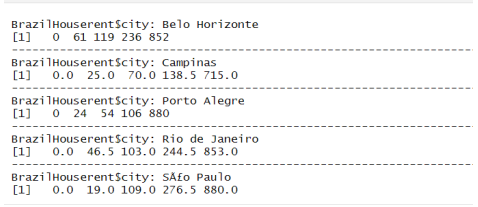

# [Exploratory Data Analysis Home Rental Prices In Brazil 🏠](https://DanukaDilshann.github.io/Data-Analysis-1/)
The dataset we are using contain house rent prices from different area of Brazil. The dataset includes Property area, how many bathrooms and bedrooms are there, how taxes are included in different areas, whether pets are allowed or not and the House is furnished or not.
Then our main goal is to understand those facts and identify which variables are related to house rent price go up or down in Brazil.

The Primary objectives are:

        Analyse the rent amount distribution
        Analyse the taxes and other expenses related to the rent amount.
        How to change the taxes in deferent different cities in Brazil
        How keeping animals affect the rent amount
        
## Abstract

The House Rental Price Dataset shows the House rental prices of different regions in Brazil. It is 
Include the multiple attributes such as City, Area (Square Feet), No. of Rooms, No. of Bathrooms, 
packing spaces, Floor, whether pets are allowed or not, whether furnished or not, Homeowners 
association tax (R$), Rent amount (R$), Municipal property tax (R$) and Fire insurance value 
(R$). Therefore, this dataset facilitates the analysis the house rental price in Brazil.

By understanding these factors that influence the Rent price of House, it is easy for house holder 
to determined the price and this helps the customer who are already looking to rent a House in Brazil 
to find house according to his price and according to his needs.

So here’s are my Research Question Regarding this Data set.

        1. Do the property taxes relate to the area?
        2. Does the fire insurance relate to when the house is furnished or not?
        3. Does the location relate to the Property taxes?
        4. Does the fire insurance price relate to the location?
        5. Does the rent amount relate to the when the house is furnished or not?
        6. Does the rent amount relate to the keeping animal?
        7. Does the rent amount relate to the city?

## Data Analysis
<b>1. Do the property taxes relate to the area?</b>

  

The above plot represents the scatter plot of Area versus Property Taxes. Observing the scatterplot, we notice a positive relationship between the two variables. After computing the Spearman correlation (rs), we find its value to be 0.5861. As this value exceeds the critical threshold, we reject the null hypothesis (H0). Thus, we can conclude that there is a positive correlation between the two variables.

 

 

<b>2. Does the fire insurance relate to when the house is furnished or not?</b>

 

 

The boxplot represents the relationship between Fire Insurance and the Furnished State of the House. From the boxplot, it's evident that there is skewness present, indicating a violation of the Normality assumption.

 

Upon examining the Five Number Summary within each boxplot, it's notable that the furnished category exhibits the highest median. This leads us to conclude that higher amounts of insurance are available for furnished houses.

 

 

<b>3. Does the location relate to the Property taxes?</b>

 

 

According to the above table We can see that São Paulo homeowners has to pay higher taxes than the other cities. Likewise, the graph shows the boxplot of each city. According to the boxplots we can see that every boxplot has skewness. Also analyze Q-Q plots of each city , we can say that the Normality assumption is violated. Again, using 

 

 

 

 

The above results present the five-number summary of property taxes for various cities, including the minimum, lower quartile, median, upper quartile, and maximum values respectively. It's evident that residents of Bole Horizonte have higher taxes compared to other cities. Consequently, we can conclude that property taxes are associated with the cities themselves.

## General Discussion and conclusions

- There is a positive relationship between the area of a property and its property taxes. Larger properties tend to have higher property taxes.

- Furnished houses generally have higher fire insurance values. This indicates that fire insurance costs are related to whether a house is furnished or not.

- Property taxes vary significantly across different cities in Brazil. Some cities impose higher property tax rates, while others have lower rates.

- Fire insurance costs also vary by city. Cities that frequently experience forest fires tend to have higher fire insurance premiums. Specifically, in our case, citizens of São Paulo pay higher fire insurance premiums compared to residents of other cities.

- The rental price of a house is influenced by whether pets are allowed. If house owners permit pets, the rent amount tends to be higher. Therefore, the rent amount is related to the policy on keeping animals.       

## [R-markdown file](https://github.com/DanukaDilshann/House-rental-price-in-Brazil/blob/main/Rmarkdown.pdf)
